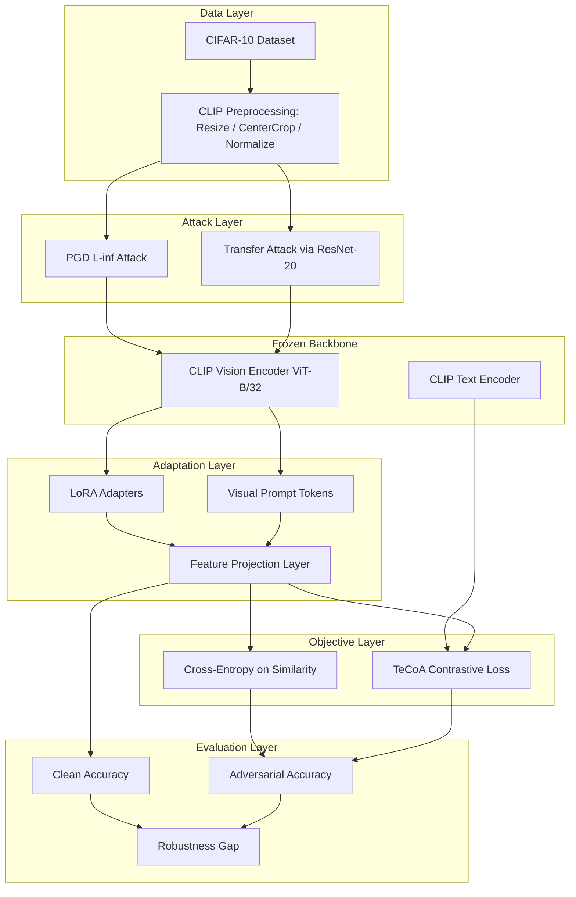
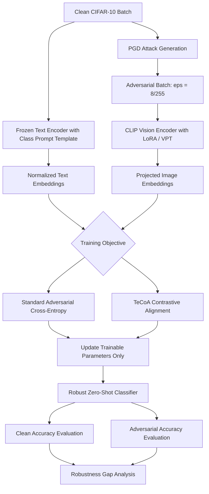

<div align="center">
  
</div>

---

# Robust Zero-Shot Classification via Parameter-Efficient Adversarial Fine-Tuning of CLIP

> A comprehensive framework restoring the adversarial robustness of large vision-language models under white-box PGD attacks via parameter-efficient fine-tuning (LoRA), Text-guided Contrastive Adversarial Training (TeCoA), and Visual Prompt Tuning.

<div align="left">

[](https://www.python.org/)
[](https://pytorch.org/)
[](https://openai.com/research/clip)
[](https://huggingface.co/docs/transformers)
[](https://huggingface.co/docs/peft)
[](https://github.com/Harry24k/adversarial-attacks-pytorch)
[](#)
[](#)
[](https://www.cs.toronto.edu/~kriz/cifar.html)
[](#)
[](https://colab.research.google.com/)
[](https://opensource.org/licenses/MIT)

</div>

## Abstract

Large-scale vision-language models such as CLIP achieve remarkable zero-shot classification performance, yet they remain critically vulnerable to imperceptible adversarial perturbations. In this project, a pre-trained CLIP ViT-B/32 model is first evaluated on CIFAR-10 under both white-box PGD attacks and transferred attacks crafted on an independently trained ResNet-20 classifier, revealing an almost complete collapse of zero-shot accuracy from **87.83%** to **0.23%**. To mitigate this vulnerability without full-model retraining, three parameter-efficient adversarial adaptation strategies are implemented and compared: (i) **LoRA-based standard adversarial training** on the CLIP vision encoder, (ii) **TeCoA (Text-guided Contrastive Adversarial training)**, which aligns adversarial image embeddings with frozen class-level text embeddings through a contrastive objective, and (iii) **Visual Prompt Tuning (VPT)** combined with TeCoA as a bonus study. Experimental results show that TeCoA with LoRA adapters achieves **96.20% clean accuracy** and **66.50% adversarial accuracy**, reducing the robustness gap from **0.876** to **0.297** while updating only a small fraction of the model parameters.

## Table of Contents

1. [Overview](#overview) — Motivation and Problem Definition
2. [System Architecture](#system-architecture) — Layered Robust Adaptation Pipeline
3. [Adversarial Training Workflow](#adversarial-training-workflow) — From Attack Generation to Robust Adaptation
4. [Methodology](#methodology) — LoRA, TeCoA, and Visual Prompt Tuning
   - 4.1 [Threat Model and PGD Attack](#41-threat-model-and-pgd-attack)
   - 4.2 [Parameter-Efficient Adaptation with LoRA](#42-parameter-efficient-adaptation-with-lora)
   - 4.3 [Text-Guided Contrastive Adversarial Training (TeCoA)](#43-text-guided-contrastive-adversarial-training-tecoa)
   - 4.4 [Visual Prompt Tuning (Bonus)](#44-visual-prompt-tuning-bonus)
5. [Experimental Setup](#experimental-setup) — Data, Models, and Hyperparameters
6. [Results and Analysis](#results-and-analysis) — Clean vs. Adversarial Trade-off
7. [Project Structure](#project-structure) — Repository Organization
8. [Usage and Installation](#usage-and-installation)
9. [Authors](#authors)

# Overview

Zero-shot classification with CLIP relies on aligning image embeddings with natural-language class descriptions in a shared multimodal space. While this alignment generalizes remarkably well to unseen distributions, it is extremely brittle under adversarial perturbations: a perturbation bounded by an `L∞` budget of `8/255` is sufficient to drive zero-shot accuracy to near-random levels.

This project investigates whether **robustness can be injected into a frozen vision-language model without full fine-tuning**, using lightweight adapters and text-guided objectives.

The pipeline covers the full experimental cycle:

* Zero-shot evaluation of pre-trained CLIP on CIFAR-10
* White-box PGD attack generation against the CLIP image encoder
* Black-box transfer attack study using an independently trained ResNet-20
* LoRA-based standard adversarial fine-tuning of the CLIP vision tower
* TeCoA text-guided contrastive adversarial training
* Visual Prompt Tuning with TeCoA as a bonus comparison
* Comprehensive quantitative and qualitative comparison of all methods

---

# System Architecture

The system follows a layered architecture in which a frozen vision-language backbone is adapted through lightweight trainable modules, while an adversarial attack generator continuously produces worst-case inputs during training. Class-level text embeddings act as fixed semantic anchors, guiding the image encoder toward representations that remain aligned under perturbation.



### Architectural Components

| Layer | Responsibility |
|---------|---------------|
| Data Layer | CIFAR-10 loading, CLIP-compatible preprocessing, and stratified splitting |
| Attack Layer | White-box PGD generation and cross-architecture transfer attacks |
| Frozen Backbone | Pre-trained CLIP vision and text encoders kept fully frozen |
| Adaptation Layer | LoRA adapters, visual prompt tokens, and image-text projection |
| Objective Layer | Standard adversarial cross-entropy and TeCoA contrastive alignment |
| Evaluation Layer | Clean / adversarial accuracy, robustness gap, and efficiency metrics |

This design isolates robustness learning inside a small set of trainable parameters, which preserves the generalization of the original multimodal representation space while substantially reducing computational and memory cost compared to full adversarial fine-tuning.

# Adversarial Training Workflow



---

# Methodology

## 4.1 Threat Model and PGD Attack

Adversarial examples are generated under an `L∞` threat model with a perturbation budget of `ε = 8/255`, a step size of `α = 2/255`, and `7` iterative steps, initialized with uniform random noise inside the epsilon ball. Unlike conventional classifiers, the attack objective is defined over the **multimodal similarity matrix** between normalized image embeddings and frozen text embeddings:

```python
image_features = clip_model.get_image_features(adv_images)
image_features = F.normalize(image_features, dim=-1)

similarity = image_features @ text_features.T
loss = F.cross_entropy(similarity, labels)
```

Two attack settings are evaluated:

* **White-box PGD** directly against the CLIP image encoder
* **Transfer attack** crafted on a CIFAR-10 ResNet-20 and evaluated on CLIP

## 4.2 Parameter-Efficient Adaptation with LoRA

Instead of updating all parameters of the ViT-B/32 vision tower, low-rank adapters are injected into the attention projection matrices (`q_proj`, `k_proj`, `v_proj`, `out_proj`). All non-LoRA parameters are explicitly frozen, so only the adapter weights receive gradients during adversarial training:

```python
for name, param in lora_vision_model.named_parameters():
    if "lora_" not in name:
        param.requires_grad = False
```

Because the LoRA-wrapped vision tower outputs `768`-dimensional pooled features while CLIP text embeddings live in a `512`-dimensional space, a lightweight linear projection layer bridges the two representation spaces before similarity computation.

## 4.3 Text-Guided Contrastive Adversarial Training (TeCoA)

TeCoA replaces the standard adversarial cross-entropy objective with a **contrastive alignment loss** between adversarial image embeddings and frozen class-level text embeddings. The text encoder remains untouched, which means class semantics act as stable anchors that cannot be corrupted by adversarial optimization.

Conceptually, the training objective encourages:

* Adversarial image embeddings to remain close to the **correct** class text embedding
* Adversarial image embeddings to be pushed away from **all other** class text embeddings

This text-guided supervision is the key reason TeCoA generalizes better than standard adversarial training: robustness is learned in the **shared multimodal space**, not in a task-specific classification head.

## 4.4 Visual Prompt Tuning (Bonus)

As a bonus study, robustness is also learned through **Visual Prompt Tuning**, where a small set of learnable prompt parameters is prepended to the visual token sequence while the entire backbone stays frozen. Combining VPT with the TeCoA objective yields an even more parameter-efficient robustification strategy, providing a direct comparison between *adapter-based* and *prompt-based* robust adaptation.

---

# Experimental Setup

| Component | Configuration |
| ----------------------- | -------------------------------------------- |
| Dataset | CIFAR-10 (10 classes) |
| Training Subset | 10,000 images (20% of the training split) |
| Validation Subset | 2,500 images (5% of the training split) |
| Test Set | 10,000 images (full official test split) |
| Input Resolution | 224 × 224 (CLIP preprocessing) |
| Vision-Language Model | `openai/clip-vit-base-patch32` |
| Surrogate Model | `cifar10_resnet20` (transfer attack source) |
| Attack | PGD-7, `L∞`, `ε = 8/255`, `α = 2/255` |
| Text Prompt Template | `"a photo of a {class}"` |
| Batch Size | 32 |
| Optimizer | Adam with `StepLR` scheduler |
| Epochs | 10 (LoRA and TeCoA) |
| Precision | Mixed precision (`autocast` + `GradScaler`) |
| Random Seed | 42 (fully reproducible splits and attacks) |

---

# Results and Analysis

### Method Comparison on CIFAR-10 Test Set

| Method | Clean Accuracy | Adversarial Accuracy | Robustness Gap | Description |
|---------|---------------|---------------------|----------------|-------------|
| CLIP (Vanilla, Zero-Shot) | 0.8783 | 0.0023 | 0.8760 | Original pre-trained CLIP without any adaptation |
| LoRA + Standard Adversarial Training | 0.9481 | 0.6116 | 0.3365 | LoRA adapters trained with adversarial cross-entropy |
| **LoRA + TeCoA** | **0.9620** | **0.6650** | **0.2970** | LoRA adapters trained with text-guided contrastive loss |

### Statistical Analysis

| Comparison | Improvement in Adversarial Accuracy |
| ------------------------------------------------ | ----------------------------------- |
| LoRA Standard Adversarial Training vs. Vanilla CLIP | **+0.6093** |
| TeCoA vs. Vanilla CLIP | **+0.6627** |
| TeCoA vs. LoRA Standard Adversarial Training | **+0.0534** |

### Observations

* Vanilla CLIP is **almost completely defeated** by a 7-step PGD attack, collapsing to `0.23%` accuracy.
* Adversarial perturbations crafted on ResNet-20 also degrade CLIP performance, confirming **cross-architecture attack transferability** between CNN and ViT-based encoders.
* Parameter-efficient adversarial training does **not** sacrifice clean accuracy — both LoRA variants surpass the original zero-shot clean accuracy after adaptation to CIFAR-10.
* TeCoA consistently outperforms standard adversarial training on both axes, achieving the **highest clean accuracy** and the **smallest robustness gap**, which supports the hypothesis that frozen text embeddings provide a more stable and semantically meaningful supervision signal.

---

# Project Structure

```text
Robust-Zero-Shot-CLIP-via-Parameter-Efficient-Adversarial-Fine-Tuning
│
├── robust_clip_adversarial_finetuning.ipynb
│
├── data/
│   └── cifar-10-batches-py/
│
├── figures/
│   ├── dataset_samples.png
│   ├── class_distribution.png
│   ├── adversarial_examples.png
│   ├── training_curves.png
│   └── method_comparison.png
│
├── results/
│   ├── method_comparison.csv
│   ├── attack_statistics.json
│   └── training_history.json
│
├── requirements.txt
│
└── README.md
```

---

# Usage and Installation

```bash
# 1. Clone the repository
git clone https://github.com/farzadjannati/Robust-Zero-Shot-CLIP-via-Parameter-Efficient-Adversarial-Fine-Tuning.git
cd Robust-Zero-Shot-CLIP-via-Parameter-Efficient-Adversarial-Fine-Tuning

# 2. Create and activate virtual environment
conda create -n robust-clip python=3.10
conda activate robust-clip

# 3. Install required packages
pip install -r requirements.txt
# Core deps: torch, torchvision, transformers, peft, torchattacks
```

### Reproducibility
To reproduce the results, execute the cells sequentially in `robust_clip_finetuning.ipynb`. A CUDA-enabled GPU is strongly recommended (e.g., Google Colab T4). All modules use deterministic random seeds (`42`).

---
# License

This project is licensed under the MIT License.

---

## Author

**Farzad Jannati**
M.Sc. Student, University of Tehran
Research Assistant @ Social Networks Lab

**Research Interests:** NLP, Large Language Models (LLMs), Vision-Language Models, Adversarial Robustness, Parameter-Efficient Fine-Tuning, Agentic AI, Retrieval-Augmented Generation (RAG)

📧 [farzadjannati@ut.ac.ir](mailto:farzadjannati@ut.ac.ir) | 💻 [github.com/farzadjannati](https://github.com/farzadjannati) | 💼 [linkedin.com/in/farzadjannati](https://www.linkedin.com/in/farzadjannati)

---

# Support

If you find this project useful, consider giving it a star ⭐

---

<p align="center">
  Built with ❤️ using PyTorch, PEFT, and TorchAttacks
</p>
